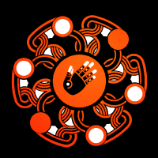

# Mir Trader v2.0

 
 

## What it does
This bot can perform [Terraswap](https://app.terraswap.io) trades for you. This bot has been modified by Chigag Studio to perform trades on mAssets from Mirror Protocol.

## !!!Testnet Bombay-12 is default edit 'const.py' for Mainnet Columbus-5

## Installation
1. Create  virtual environment: `python -m venv venv`
2. `. venv/bin/activate`
3. `pip install -r requirements.txt`

## Using it

Set the environment variables:

* create .env file at root of project
* write `PK=encoded_key` in .env 
* encoded_key is the private key of your wallet to trade with (read section below on how to find it)

Then execute the following commands:

1. `. venv/bin/activate` (if not done yet)
2. `python cli.py` will start the CLI

### Commands
* `price`: Show price for selling/buying
* `amount-luna`: Set the luna amount for buying bLuna
* `amount-bluna`: Set the bLuna amount for selling bLuna
* `amount-ust`: Set the UST amount for buying mAsset
* `amount-mspy`: Set the mSPY amount for selling mSPY
* `inv-sell-price`: Sets the price for when to sell
* `buy-price`: Sets the price for when to buy
* `spread`: Sets the maximum spread (default 0,5%)
* `mode-buy`: Sets the bot to buying mode (will toggle automatically when bought)
* `mode-sell`: Sets the bot to selling mode (will toggle automatically when sold)
* `buy`: Manually buys bLuna
* `sell`: Manually sells bLuna
* `mirror_buy`: Manually buys configured mAsset
* `mirror_sell`: Manually sells configured mAsset
* `bot`: Starts the bot. Stop it with [Ctrl]+[C]
* `mirrorbot`: Starts the Mirror bot. Stop it with [Ctrl]+[C]

## Finding your private key
1. Export the "private key" in your Terra Station
2. Decode this base64 string and take the encoded key from the dict
3. Online decode tool https://www.base64decode.org/

